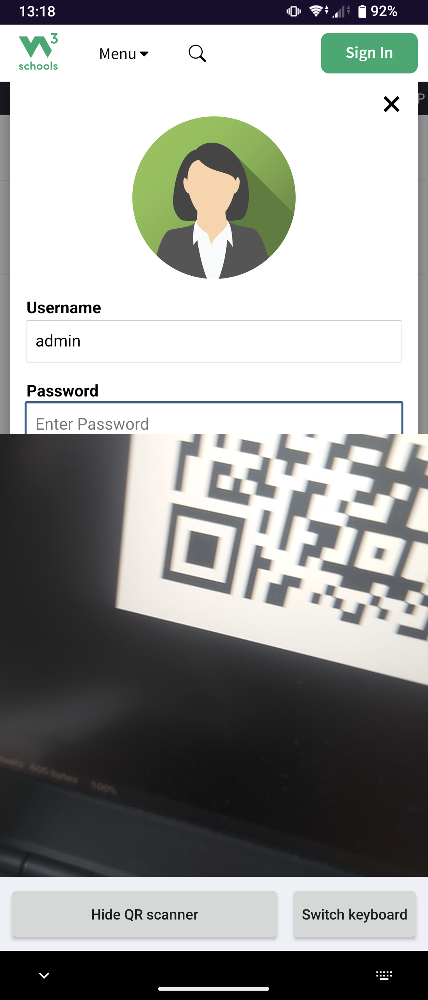

# QR tools

This app's structure follows the architecture guideline in [Invertisment/scaffolding](https://github.com/Invertisment/scaffolding): code is split into a pure `core` layer, an `infra` layer for anything touching the camera/OS, and a `glue` layer for framework entry points — with `core` never allowed to depend on `infra` or `glue`, and `infra` never allowed to depend on `glue`. These boundaries aren't just a convention: a Konsist-based test (`ArchitectureTest`) mechanically enforces them and fails the build if a file lands under the wrong layer or imports across a forbidden direction. QR tools exists partly as a concrete example of an app gated this way.

A small Android utility built around two features:

- A keyboard (input method) with a "Scan QR code" button that opens a camera popup in place, without hiding the keyboard or losing focus on the field you're typing into.
- A share-target: share any text from any app and get a QR code for it in a popup.

No ads, no analytics, no network access. Camera permission is only used while actively scanning.

## Building

```
./gradlew :app:assembleDebug
```

Run the test suite with:

```
make test
```

## License

GPL-3.0-or-later. See [LICENSE](LICENSE).

## F-Droid

Deployment to F-Droid is pending (submitted, awaiting merge review here: https://gitlab.com/fdroid/fdroiddata/-/merge_requests/47006).


